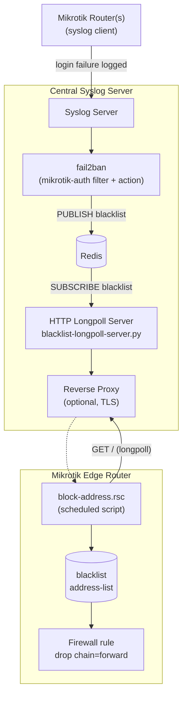
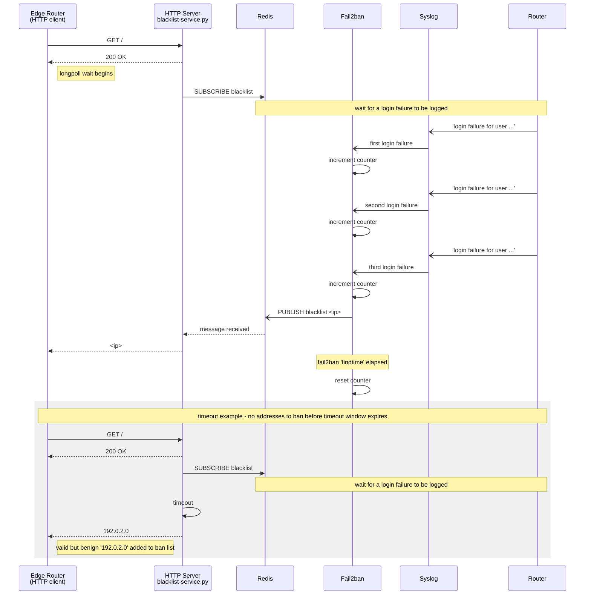

# Architecture

Blacklist-as-a-Service watches a central syslog server for failed Mikrotik
login attempts, uses fail2ban to detect repeated failures from the same
address, and publishes offending addresses through Redis to a longpoll HTTP
server. Edge routers poll that server and add returned addresses to a local
firewall block list.

## System Diagram

## Sequence Diagram

